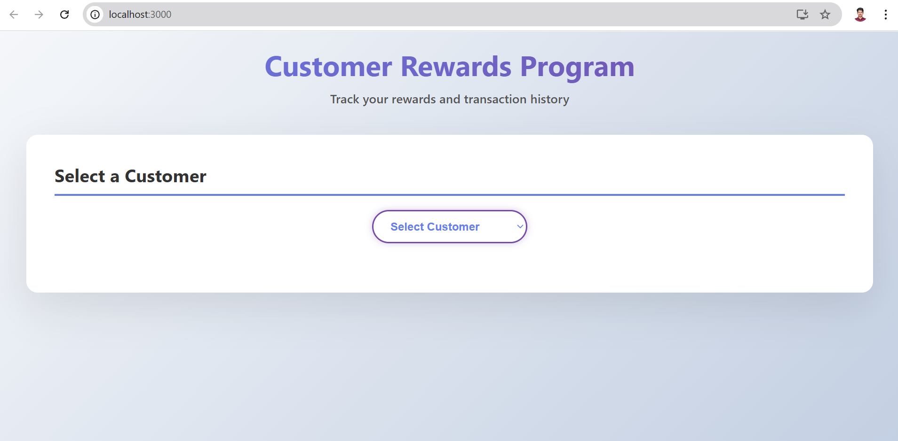
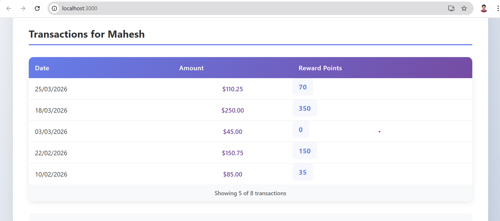
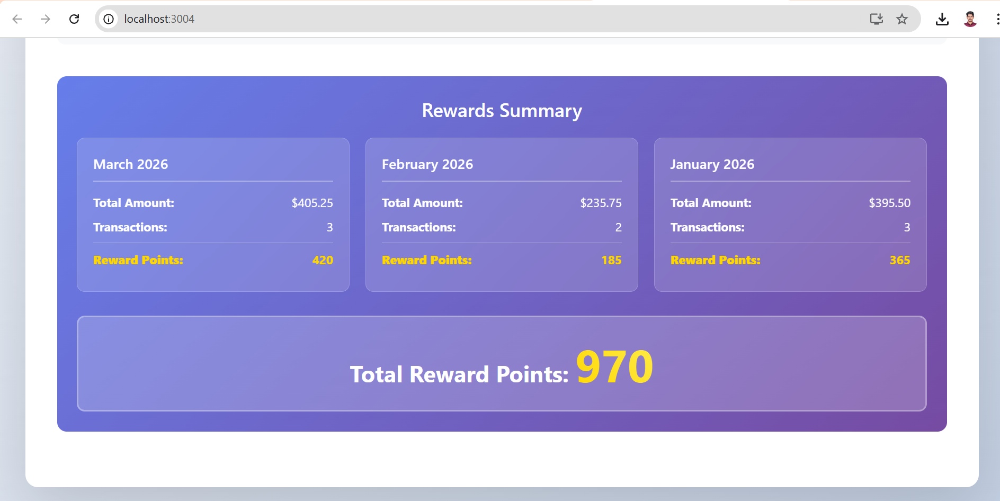
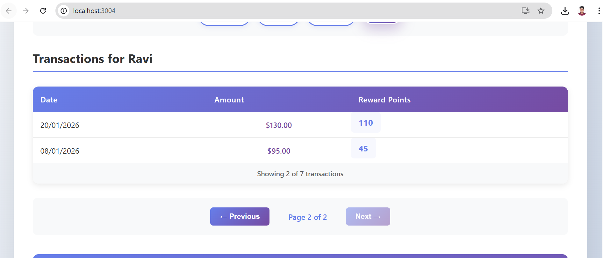
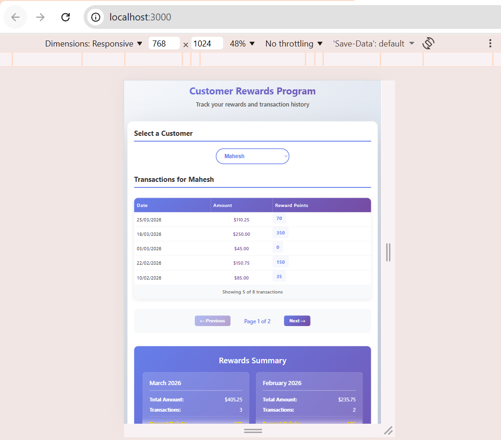
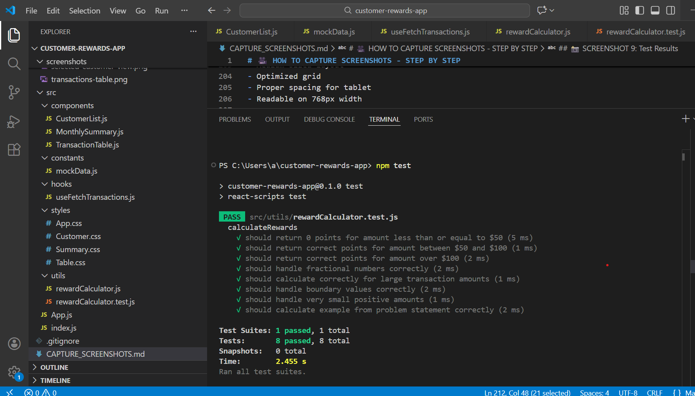

# Customer Rewards Program

This is a React-based application that shows how a customer rewards program can work in a retail scenario.

The app keeps track of customer purchases over a three-month period and calculates reward points based on how much each customer spends on every transaction.

## Features

- Allows selecting a customer to view their purchase history
- Automatically calculates reward points based on transaction amount
- Shows reward points earned per month along with the total rewards
- Supports pagination to handle a large number of transactions smoothly
- Responsive layout that works well across desktop and mobile devices
- Includes unit tests to validate the reward calculation logic
- Uses PropTypes for basic type validation in components
- Applies performance optimizations such as React.memo, useCallback, and useMemo


## Reward Calculation Logic

Reward points are calculated based on the value of each transaction using the following rules:

- Purchases up to $50 do not earn any points
- For purchases between $50 and $100, customers earn 1 point for every dollar spent over $50
- For purchases above $100, customers earn:
  - 50 points for the amount between $50 and $100
  - 2 points for every dollar spent over $100

### Example

If a customer makes a purchase of $120:

- $20 x 2 = 40 points (amount over $100)
- $50 x 1 = 50 points (amount between $50 and $100)
- Total reward points: 90


## Project Structure

The project is organized to keep components, logic, and styles separated for better readability and maintenance.


```
customer-rewards-app/
├── public/
│   ├── index.html                 # Main HTML entry point
│   ├── manifest.json              # PWA manifest file
│   ├── robots.txt                 # SEO robots configuration
│   └── data/
│       └── mockdata.json          # Sample transaction data (3 months)
├── src/
│   ├── components/
│   │   ├── CustomerList.js        # Dropdown selector for customers
│   │   ├── TransactionTable.js    # Transaction display with pagination
│   │   └── MonthlySummary.js      # Monthly rewards summary view
│   ├── hooks/
│   │   └── useFetchTransactions.js # Custom hook for async data fetching
│   ├── utils/
│   │   ├── rewardCalculator.js    # Reward calculation logic & algorithms
│   │   └── rewardCalculator.test.js # Unit tests for reward calculations
│   ├── constants/
│   │   └── appConstants.js        # Application-wide constants (items per page, etc.)
│   ├── styles/
│   │   ├── App.css                # Main application styles
│   │   ├── Customer.css           # Customer list component styles
│   │   ├── Summary.css            # Summary component styles
│   │   └── Table.css              # Transaction table styles
│   ├── App.js                     # Main app component & state management
│   └── index.js                   # React DOM entry point
├── screenshots/                   # UI screenshots and mockups
├── package.json                   # Project dependencies & scripts
├── README.md                      # Project documentation
```

## Getting Started

### Prerequisites

- Node.js (v14 or higher)
- npm or yarn package manager

### Installation

1. **Clone the repository** (or navigate to the project directory)
   ```bash
   cd customer-rewards-app
   ```

2. **Install dependencies**
   ```bash
   npm install
   ```

3. **Start the development server**
   ```bash
   npm start
   ```

   The application will open at [http://localhost:3000](http://localhost:3000)

## Usage

- Select a customer by clicking on the customer button to view their transactions
- View all purchases in the transaction table along with calculated reward points
- Use the pagination controls to navigate through multiple pages of transactions
- Check the monthly summary to see the reward points earned per month and the overall total

## Application Screenshots

### Main Interface - Customer Selection

*Main application view with customer selection buttons and header*

### Transaction Display with Rewards

*Transaction table showing dates, amounts, and calculated reward points*

### Monthly Rewards Summary

*Monthly breakdown of transactions and rewards with grand total*

### Pagination in Action

*Page 2 of transactions demonstrating pagination feature*

### Responsive Design

**Mobile View (375px)**

*Application optimized for mobile devices with single-column layout*

**Tablet View (768px)**

*Application optimized for tablets with responsive grid layout*

## Testing

### Run Test Suite

```bash
npm test
```

This will run all test cases for the reward calculator function.

### Test Results



*All 8 test cases passing successfully - demonstrating comprehensive coverage*

### Test Coverage

The `rewardCalculator.test.js` includes 8 comprehensive test suites:

1. **Amounts ≤ $50** - Verify 0 points awarded
2. **Amounts $50-$100** - Verify 1 point per dollar calculation
3. **Amounts > $100** - Verify 50 + 2x calculation
4. **Fractional Numbers** - Ensure proper rounding with decimal amounts
5. **Large Amounts** - Test scalability with large transaction values
6. **Boundary Values** - Test exact boundary conditions
7. **Small Amounts** - Test very small positive values
8. **Problem Statement Example** - Verify $120 transaction = 90 points

**Example Test Cases:**
```javascript
calculateRewards(75) → 25 points     // $75 - $50 = 25
calculateRewards(120) → 90 points    // 50 + (2 × 20) = 90
calculateRewards(120.99) → 90 points // Fractional handling
calculateRewards(1000) → 1850 points // Large amounts
```

**Test Status:** ✅ **8/8 PASSING**

### Build & Deployment


*Production build completes successfully with no errors*

```bash
npm run build
```

Build creates an optimized production bundle ready for deployment.

## UI/UX Features

### Modern Design
- Clean, card-based layout for better readability
- Responsive grid system that adapts to different screen sizes
- Subtle hover effects and smooth transitions
- Simple and consistent styling across the application

### Color Scheme
- Primary colors use a purple to indigo gradient (#667eea to #764ba2)
- Light blue and gray shades are used for backgrounds
- Accent colors are applied sparingly for highlights


### Responsive Breakpoints
- Desktop: screens wider than 768px
- Tablet: screens 768px and below
- Mobile: screens 480px and below


## Key Technologies

- React (v19.2.4) for building the user interface
- React Hooks for state management and performance optimizations
- PropTypes for runtime type checking of components
- Jest for unit testing
- CSS3 for styling and basic animations


## Component Details

### CustomerList.js

- Memoized to avoid unnecessary re-renders
- Displays the list of available customers from the data set
- Receives customer names and a selection callback as props
- Uses PropTypes to validate incoming props


### TransactionTable.js

- Manages pagination logic internally
- Displays transaction date, amount, and calculated reward points
- Formats currency values for better readability
- Uses a responsive table layout for different screen sizes
- Applies PropTypes with shape validation for incoming data


### MonthlySummary.js

- Groups reward points by month
- Displays the number of transactions for each month
- Highlights the total reward points earned
- Uses useMemo to avoid unnecessary recalculations


### useFetchTransactions.js

- Simulates an asynchronous API call for fetching transactions
- Returns both the transaction data and loading state
- Includes cleanup logic when the component is unmounted
- Uses a one-second delay to mimic network latency


## Sample Data

The application uses sample data consisting of 25 transactions across four customers (Mahesh, Ravi, Priya, and Rajesh).  
The data covers purchases made during January, February, and March 2026, with transaction amounts ranging from $40 to $300.

## Performance Optimizations

- Uses React.memo to prevent unnecessary component re-renders
- Applies useCallback to memoize callbacks passed to child components
- Uses useMemo for handling expensive calculations efficiently
- Ensures proper cleanup in useEffect to avoid memory leaks
- Implements pagination to manage large data sets smoothly


## How It Works

1. Transaction data is loaded using the useFetchTransactions hook, which simulates an API call with a one-second delay
2. A customer is selected using memoized buttons to avoid unnecessary re-renders
3. Transactions are filtered and sorted based on the selected customer
4. Pagination is applied to handle larger data sets (five items per page)
5. Reward points are calculated for each transaction in real time
6. Monthly totals are calculated and displayed in t


## Code Highlights

### Reward Calculator

The reward calculation logic is handled in a small utility function that applies the business rules based on the transaction amount.

```javascript
export const calculateRewards = (amount) => {
  if (amount <= 50) return 0;

  let points = 0;

  if (amount > 100) {
    points += Math.floor(amount - 100) * 2;
    points += 50;
  } else {
    points += Math.floor(amount - 50);
  }

  return points;
};

```

### Performance-Optimized Hooks

The application uses memoization to reduce unnecessary recalculations and re-renders when working with derived data and callbacks.

```javascript
// Memoized unique customers
const customers = useMemo(() => {
  return [...new Set(data.map(d => d.customerName))].sort();
}, [data]);

// Memoized callback for selection
const handleCustomerSelect = useCallback((customerName) => {
  setSelectedCustomer(customerName);
  setCurrentPage(1);
}, []);


## Learning Resources

This project demonstrates the following concepts:

- Building applications using React functional components and hooks
- Creating and using custom hooks
- Applying performance optimization techniques
- Component composition and reusability
- Writing unit tests using Jest
- Implementing responsive design patterns
- Using modern CSS for styling


## Future Enhancements

Possible improvements that could be added in the future include:

- Adding an infinite scroll option for transactions
- Allowing data export in CSV format
- Adding filters based on date range
- Integrating a backend API for real data
- Introducing a basic customer management dashboard


## Support

For questions or implementation details, please refer to the inline code comments and existing test cases.

